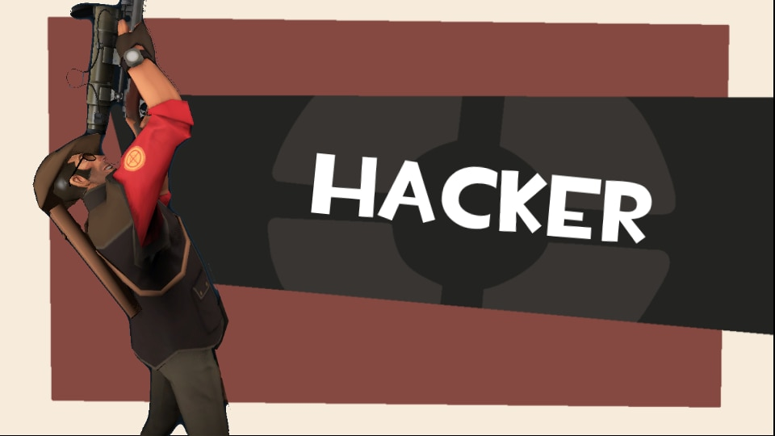

## Past

Team Fortress 2 has a special place in my heart. It was my first first-person shooter game growing up, and it's the game in my Steam library that I have the most hours in—1,626 hours at the time of writing. The only other game that comes close (and likely surpasses) is Minecraft, which deserves its own essay at some point in the future.

When exactly I started playing Team Fortress 2 is a blur. If I had to guess, I started sometime late middle school. But I do have strong memories of playing it in high school, as I found friends who would play the game with me.

High school was a time when I discovered custom maps, specifically those for practicing skills. I learned to rocket jump here:

At some point I got good at airshotting not just with rockets, but with airblasted rockets:

I also practiced airshotting with pipes:

Which led to me hitting epic shots like these in-game:

At the time, I think I had in my head this fantasy of somehow playing competitively, maybe even professionally. I'm competitive by nature, and I enjoy the feeling of playing with a team for a common goal.

I'm not sure when I stopped playing TF2. I definitely did not play during college—I didn't have a Windows computer to play it on. Yet even if I were able to play, I don't know if I would have enjoyed it. Most of my friends were also busy with college, and even in moments when we were free, we had moved on to trying other games like Apex Legends, Overwatch 2, [BattleBit](https://store.steampowered.com/app/671860/BattleBit_Remastered/), our annual 1-month Minecraft server, hell even [Stick Fight](https://store.steampowered.com/app/674940/Stick_Fight_The_Game/). TF2 was a dead game, not only to us, but seemingly to the rest of its player-base. I wasn't playing at the time, but my understanding is that the game was riddled with hackers that looked like the following:

That is, until just a month ago from the time of writing.

## Present

...

## Future