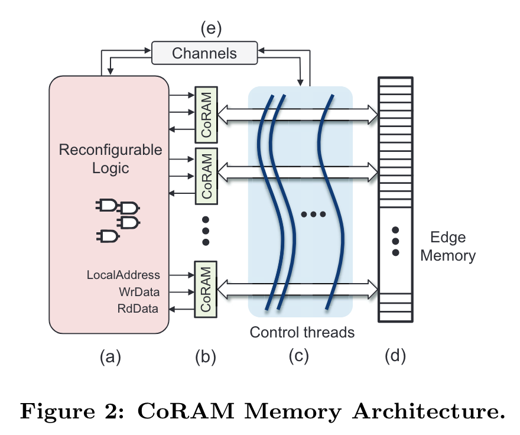
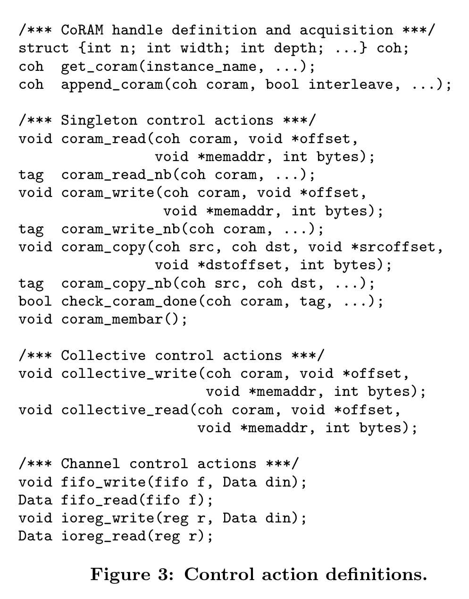
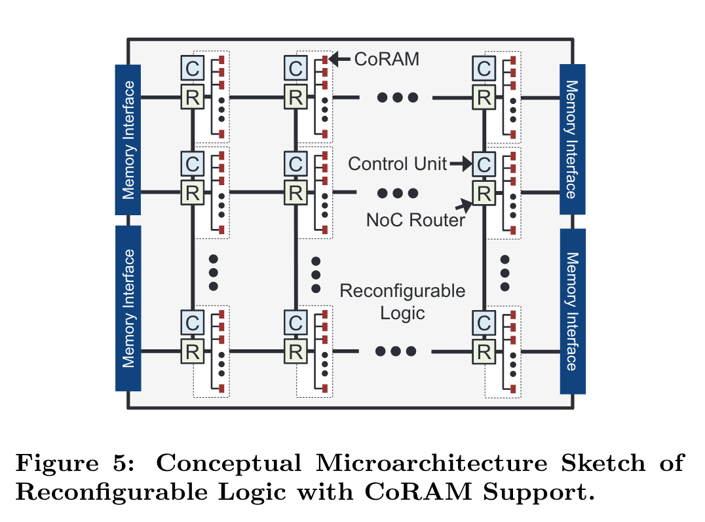
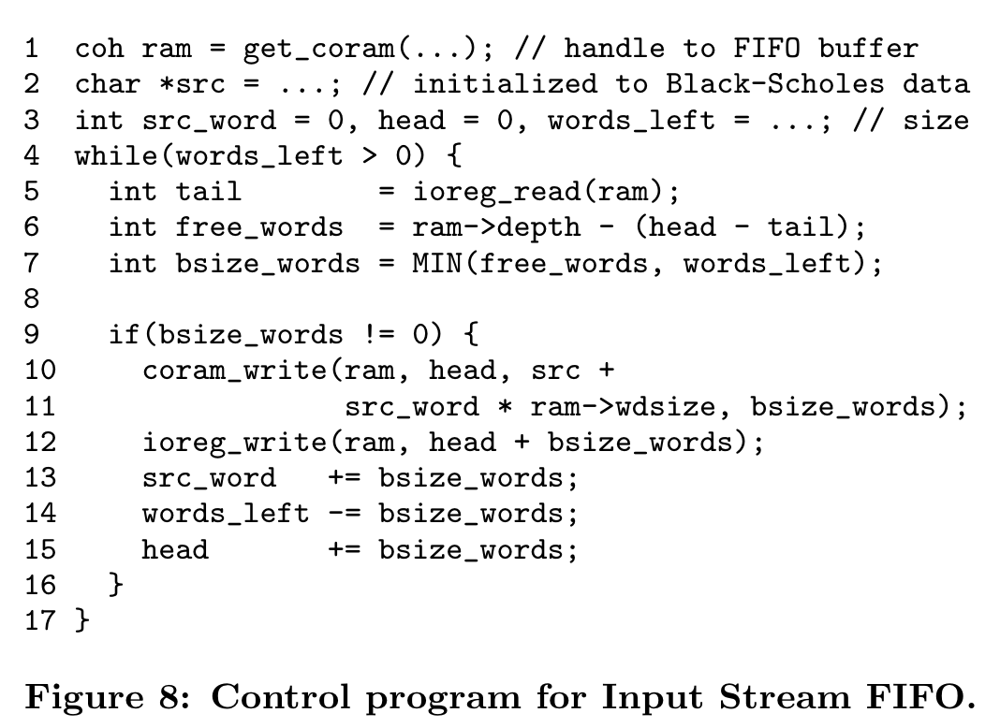
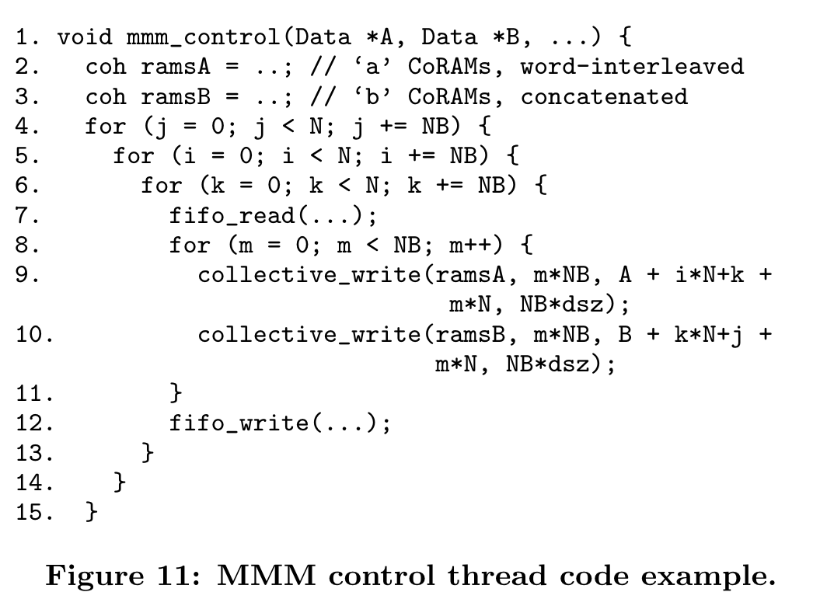
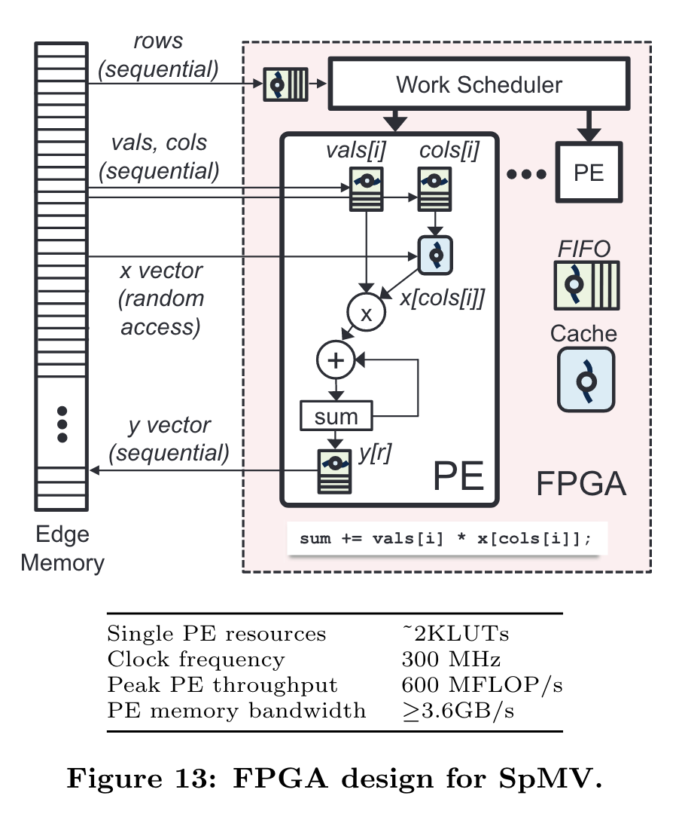
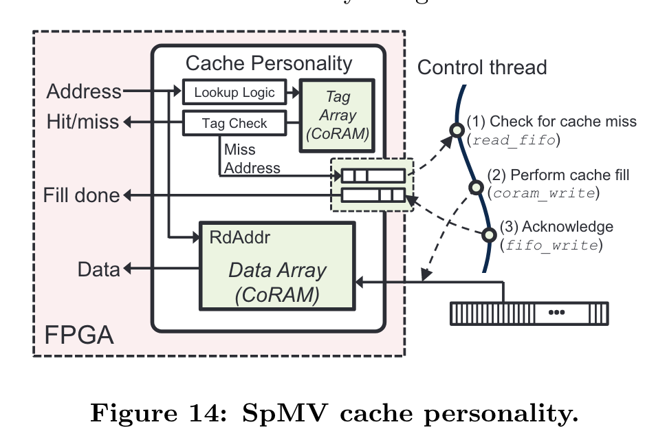

**Authors:** Eric S. Chung, James C. Hoe, Ken Mai 
**Conference:** FPGA 2011 
**DOI:** [ACM](https://dl.acm.org/doi/abs/10.1145/1950413.1950435)

## Background

FPGAs are known to provide orders-of-magnitude speedup to compute while also being more energy efficient than CPUs.[^1] If they're so great, why then are not they more widely deployed? This paper argues that it is because of the design effort required to program an FPGA, especially the design of data movement and memory interfacing.

[^1]: This kind of statement deserves an asterisk.

## Four Main Points

### 1. CoRAM Architecture

The goal of the paper is to ease the design effort of programming an FPGA. The paper decouples the design of the memory interface from the compute kernel via CoRAM, a generic memory architecture for FPGAs.

The paper posits that a good architecture—whether it be for processors, FPGA memory, or any other system that separates the user-facing interface from the internal implementation—should be:
1. **Universal.** “...present to the user a common, virtualized appearance of the FPGA fabric…”
2. **Easy-to-use.** “...a standard, easy-to-use mechanism for controlling the transport of data between memory interfaces and the SRAMs used by the application…”
3. **Stable.** “...amenable to scalable FPGA microarchitectures without affecting the architectural view presented to existing applications”

The CoRAM architecture abstracts an FPGA device into four components:
1. **Reconfigurable Logic.** The compute kernel lives here. To respect the CoRAM architecture, the logic must not directly interface with memory. It must instead go through CoRAM to interact with memory.
2. **CoRAMs.** Operate exactly like BRAMs (fabric-embedded SRAM), except they are managed by CoRAMs to read from and write to memory. A CoRAM can be controlled by at most one control thread. My guess is that a CoRAM that is not managed by a control thread is simply a general-purpose BRAM.
3. **Control Threads.** Programmer-defined "FSMs" that decide when and how to interact with memory.
4. **Channels.** How the logic communicates with control threads.

The CoRAM memory architecture is exposed to the programmer via control actions, which effectively act as the CoRAM "ISA", defining legal operations for interacting with memory.

The paper asserts that these memory operations are generic enough to implement all kinds of memory "personalities" or archetypes. An important design decision that they made was to express the control actions in a high-level "C-based" software language. On the programmer side, orchestrating data movement in a higher-level abstraction simplifies the design effort.

### 2. An Example CoRAM Microarchitecture

The paper puts forth their own example microarchitecture that implements the CoRAM architecture. The microarchitecture mirrors the conventional organization of modern FPGAs:

- Columns of BRAM are replaced with CoRAMs and grouped into clusters.
- Each cluster gets its own control unit.
- A control unit is either an FSM implemented in logic (via [[high-level synthesis]]) or a multithreaded processor running CoRAM control code.
- CoRAM clusters share a single router.
- Clusters are connected globally using a 2D mesh.

The paper mentions that ideally the microarchitectural components of CoRAM should be hardened, reducing FPGA resource overhead and shortening the critical path of CoRAM.

### 3. Usage Examples of CoRAM

#### Black-Scholes
The Black-Scholes algorithm implemented in hardware can be abstracted as a black box, with inputs streamed in and outputs streamed out. Thus, the memory personality suited for this kernel is a streaming FIFO, expressed in the following code:

While not an entirely interesting example—and not one that is terribly complex to implement in RTL—it is expressed in just 17 lines.
#### Matrix-Matrix Multiplication
The classic blocked matrix multiplication. Some important details to notice are:
- The control thread waits for a signal (line 7)
- The CoRAMs for sub-matrices A and B are fed data in different strides, one row-major and one column-major.
- The control thread sends a signal back to the kernel letting it know that the data is ready (line 12).

#### Sparse Matrix-Vector Multiplication
A much more interesting example that makes use of [[compressed sparse row]] format to store sparse matrices. The overall design has the following structure:

The matrix rows indices are read into a FIFO. The rows are divided among processing elements via the work scheduler. A processing element reads in matrix columns and values for its row. It also reads in vector values into a cache, which will soon be described. The operands are multiplied and then accumulated. A cache is used to support the random access pattern of the vector, as the placement of values within a row of a sparse matrix is data-dependent.

To implement the cache, two CoRAMs are used—one for a tag array, one for a data array, just like most CPU cache organizations. The surrounding logic is implemented using reconfigurable logic.
### 4. Evaluation of CoRAM

#### Methodology
The paper uses a cycle-level simulation model written in [[Bluespec SystemVerilog]] to gather performance data. Synthesis results are used to gather power and area data.

#### Results
...

## Biggest Weakness

...

## Conclusions for Future Work

...